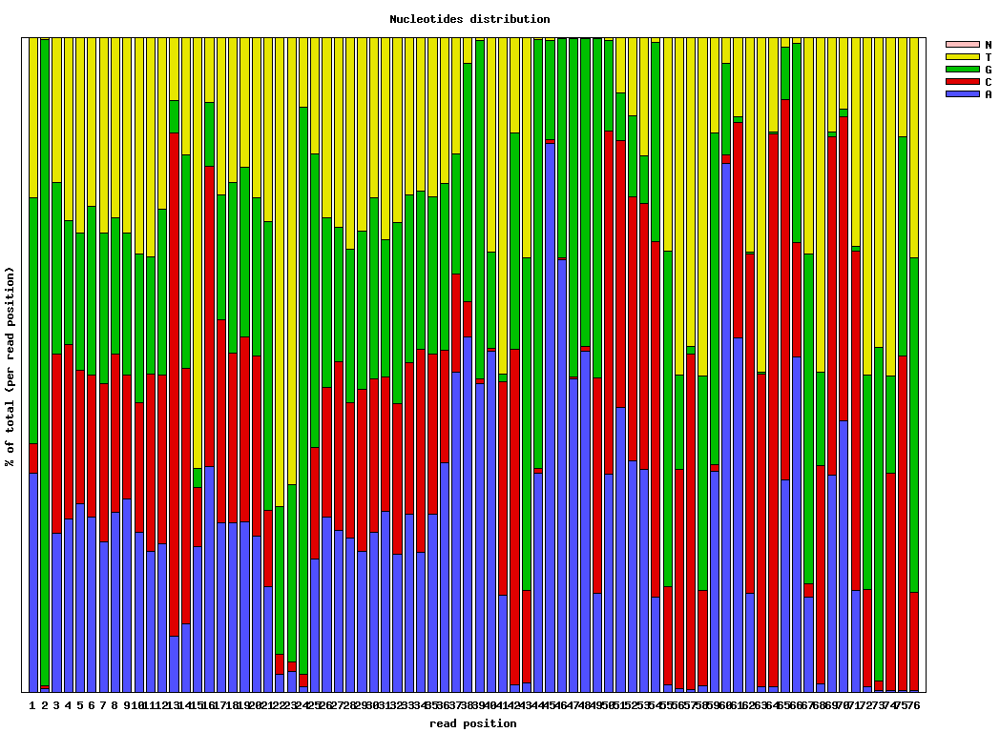
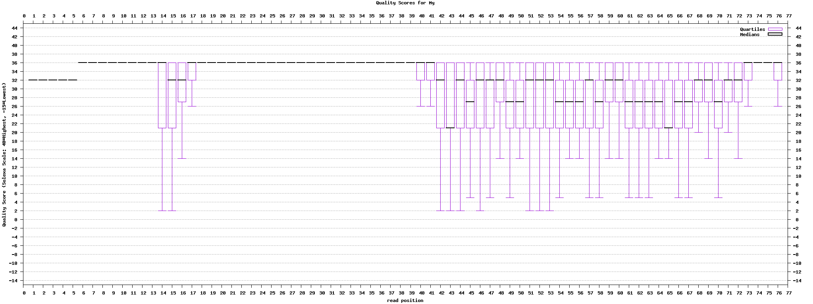

## Dockerized  [FASTX-Toolkit](http://hannonlab.cshl.edu/fastx_toolkit/index.html)

[FASTX-Toolkit] (http://hannonlab.cshl.edu/fastx_toolkit/index.html) FASTQ/A short-reads pre-processing tools

### Usage:

Docker Pull Command:

```
docker pull alexcoppe/fastx
```

Example:

```
docker run --rm -it -v $(pwd):/data fastx fastx_quality_stats -i /data/in.fastq -o /data/stats.txt

docker run --rm -it -v $(pwd):/data fastx fastq_quality_boxplot_graph.sh -i /data/stats.txt -o /data/quality.png -t "My Library"

docker run --rm -it -v $(pwd):/data fastx fastx_nucleotide_distribution_graph.sh -i /data/stats.txt -o /data/nuc.png "My Library"
```

The above commands produce two png images with charts likes the following ones:


